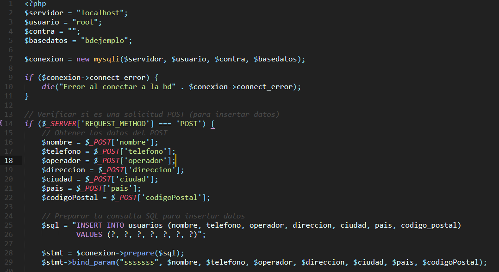
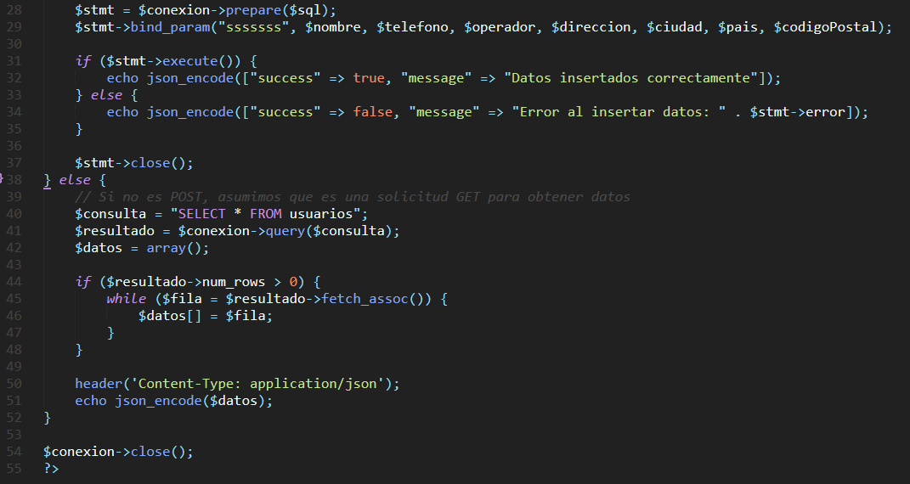
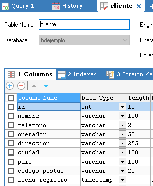

LOGIN FLUTTER

**1. En el proyecto API que tenemos en la ruta C://Xampp/htdocs/api_flutter, deberá crear el fichero de nombre "login.php"**
Escribir el comando: 

Linea::

  <?xml version="1.0" encoding="utf-8"?>
  <androidx.constraintlayout.widget.ConstraintLayout xmlns:android="http://schemas.android.com/apk/res/android"
      xmlns:app="http://schemas.android.com/apk/res-auto"
      xmlns:tools="http://schemas.android.com/tools"
      android:id="@+id/main"
      android:layout_width="match_parent"
      android:layout_height="match_parent"
      tools:context=".MainActivity">
  
      <LinearLayout
          android:id="@+id/linearLayout"
          android:layout_width="0dp"
          android:layout_height="wrap_content"
          android:orientation="vertical"
          android:padding="16dp"
          app:layout_constraintEnd_toEndOf="parent"
          app:layout_constraintStart_toStartOf="parent"
          app:layout_constraintTop_toTopOf="parent">
  
          <TextView
              android:layout_width="match_parent"
              android:textAlignment="center"
              android:layout_height="wrap_content"
              android:layout_marginBottom="16dp"
              android:text="Registro de Contacto"
              android:textSize="24sp"
              android:textStyle="bold" />
  
          <TextView
              android:layout_width="wrap_content"
              android:layout_height="wrap_content"
              android:layout_marginTop="8dp"
              android:text="Usuario:" />
  
          <EditText
              android:id="@+id/txtnombreUsuario"
              android:layout_width="match_parent"
              android:layout_height="wrap_content"
              android:hint="Nombre de usuario" />
  
          <TextView
              android:layout_width="wrap_content"
              android:layout_height="wrap_content"
              android:layout_marginTop="8dp"
              android:text="Teléfono:" />
  
          <LinearLayout
              android:layout_width="match_parent"
              android:layout_height="wrap_content"
              android:orientation="horizontal">
  
              <EditText
                  android:id="@+id/txtTelefono"
                  android:layout_width="0dp"
                  android:layout_height="wrap_content"
                  android:layout_weight="1"
                  android:hint="Nro Teléfono" />
  
              <Spinner
                  android:id="@+id/spOperador"
                  android:layout_width="wrap_content"
                  android:layout_height="wrap_content"
                  android:hint="Area" />
  
          </LinearLayout>
  
          <TextView
              android:layout_width="wrap_content"
              android:layout_height="wrap_content"
              android:layout_marginTop="8dp"
              android:text="Dirección:" />
  
          <EditText
              android:id="@+id/txtDireccion"
              android:layout_width="match_parent"
              android:layout_height="wrap_content"
              android:hint="Dirección" />
  
          <EditText
              android:id="@+id/txtCiudad"
              android:layout_width="match_parent"
              android:layout_height="wrap_content"
              android:hint="Ciudad" />
  
          <LinearLayout
              android:layout_width="match_parent"
              android:layout_height="wrap_content"
              android:orientation="horizontal">
  
              <Spinner
                  android:id="@+id/spPais"
                  android:layout_width="0dp"
                  android:layout_height="wrap_content"
                  android:layout_weight="1"
                  android:hint="Estado" />
  
              <EditText
                  android:id="@+id/txtCodigoPostal"
                  android:layout_width="0dp"
                  android:layout_height="wrap_content"
                  android:layout_weight="1"
                  android:hint="Zip" />
  
          </LinearLayout>
  
          <TextView
              android:layout_width="wrap_content"
              android:layout_height="wrap_content"
              android:layout_marginTop="8dp"
              android:text="Correo:" />
  
          <EditText
              android:id="@+id/txtEmail"
              android:layout_width="match_parent"
              android:layout_height="wrap_content"
              android:hint="Correo Electrónico" />
  
          <TextView
              android:layout_width="wrap_content"
              android:layout_height="wrap_content"
              android:layout_marginTop="8dp"
              android:text="Cumpleaños:" />
  
          <EditText
              android:id="@+id/txtFechaNacimiento"
              android:layout_width="match_parent"
              android:layout_height="wrap_content"
              android:hint="Fecha de Nacimiento" />
  
          <Button
              android:id="@+id/btnGuardar"
              android:layout_marginTop="20dp"
              android:layout_width="match_parent"
              android:layout_height="wrap_content"
              android:text="Guardar" />
  
  
      </LinearLayout>
  
  </androidx.constraintlayout.widget.ConstraintLayout>

**2. En el archivo api.php; actualizar el código... que quede así**

**2. Crearse en su servidor local MYSQL la siguiente tabla "cliente" para la base de datos "bdejemplo"**

LOGIN FLUTTER

**3. En el archivo "MainActivity.java" copiar el siguiente código**
Escribir el comando: 

Linea::

  package com.example.appcrud;
  import android.os.Bundle;
  import android.view.View;
  import android.widget.EditText;
  import android.widget.Spinner;
  import android.widget.Button;
  import android.widget.Toast;
  
  import androidx.appcompat.app.AppCompatActivity;
  
  import com.android.volley.Request;
  import com.android.volley.RequestQueue;
  import com.android.volley.Response;
  import com.android.volley.VolleyError;
  import com.android.volley.toolbox.StringRequest;
  import com.android.volley.toolbox.Volley;
  
  import java.util.HashMap;
  import java.util.Map;
  
  public class MainActivity extends AppCompatActivity {
  
      // Declaración de variables para los campos del formulario
      private EditText editTextNombre, editTextTelefono, editTextDireccion, editTextCiudad, editTextCodPostal, editTextEmail, editTextFnacimiento;
      private Spinner spinnerOperador, spinnerPais;
      private Button buttonGuardar;
  
      @Override
      protected void onCreate(Bundle savedInstanceState) {
          super.onCreate(savedInstanceState);
          setContentView(R.layout.activity_main);
  
          // Inicialización de los componentes de la UI
          initializeUIComponents();
  
          // Configuración del botón de envío
          buttonGuardar.setOnClickListener(new View.OnClickListener() {
              @Override
              public void onClick(View v) {
                  submitForm();
              }
          });
      }
  
      // Método para inicializar los componentes de la UI
      private void initializeUIComponents() {
          editTextNombre = findViewById(R.id.txtnombreUsuario);
          editTextTelefono = findViewById(R.id.txtTelefono);
          editTextDireccion = findViewById(R.id.txtDireccion);
          editTextCiudad = findViewById(R.id.txtCiudad);
          editTextCodPostal = findViewById(R.id.txtCodigoPostal);
          editTextEmail = findViewById(R.id.txtEmail);
          editTextFnacimiento = findViewById(R.id.txtFechaNacimiento);
          spinnerOperador = findViewById(R.id.spOperador);
          spinnerPais = findViewById(R.id.spPais);
          buttonGuardar = findViewById(R.id.btnGuardar);
      }
  
      // Método para enviar el formulario
      private void submitForm() {
          String url = "http://localhost/jburgos/api.php"; // Reemplaza con la URL de tu API
  
          StringRequest stringRequest = new StringRequest(Request.Method.POST, url,
                  new Response.Listener<String>() {
                      @Override
                      public void onResponse(String response) {
                          Toast.makeText(MainActivity.this, "Datos enviados con éxito", Toast.LENGTH_LONG).show();
                      }
                  },
                  new Response.ErrorListener() {
                      @Override
                      public void onErrorResponse(VolleyError error) {
                          Toast.makeText(MainActivity.this, "Error al enviar datos: " + error.getMessage(), Toast.LENGTH_LONG).show();
                      }
                  }) {
              @Override
              protected Map<String, String> getParams() {
                  Map<String, String> params = new HashMap<>();
                  params.put("nombre", editTextNombre.getText().toString());
                  params.put("telefono", editTextTelefono.getText().toString());
                  params.put("operador", spinnerOperador.getSelectedItem().toString());
                  params.put("direccion", editTextDireccion.getText().toString());
                  params.put("ciudad", editTextCiudad.getText().toString());
                  params.put("pais", spinnerPais.getSelectedItem().toString());
                  params.put("codigoPostal", editTextCodPostal.getText().toString());
                  return params;
              }
          };
  
          RequestQueue requestQueue = Volley.newRequestQueue(this);
          requestQueue.add(stringRequest);
      }
  }

**4. NO SE OLVIDEN AGREGAR LA SIGUIENTE DEPENDENCIA, dentro del archivo "build.gradle(Module: app)**
Escribir el comando: 

Linea::
  implementation 'com.android.volley:volley:1.2.1'
